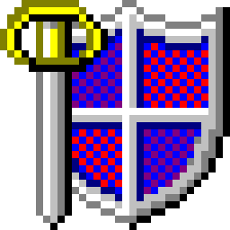

  

# SwiftMenu

This is another chooser menu.  The world doesn't really need another chooser.  But it's mine.  I
used to use `dmenu` then `xmenu` and that was fine.  I wish it still were fine.  Unfortunately,
these days macOS prevents another app from foregrounding itself while a NSSecureTextField has focus,
which is fair enough.  However, this breaks the old-fashioned flow of using Hammerspoon to bind a
keyboard shortcut to run a script which does something like `pass show $(xmenu $options)`.

This crappy little utility gets around that by having an "out of band" way of talking to it, namely
via a very simple REST API.  You can first call `/show` on it, then use Hammerspoon to foreground
it, then call the (synchronous) `/query_password` endpoint which will return the option the user
picked or 404 if cancelled.

I think i need to go away and take a few consecutive showers.

Here's a screenshot:

## How matching works

* This probably doesn't suit anyone else's preference.  That's fine.
* We split search terms on whitespace, we don't worry about literal spaces in candidates.
* Some substrings are very popular, but i still want to be able to match on them.
    * For example, in a list containing "foozoo.com" and "zoo.com.au", searching for "zoo." should
      surface zoo.com.au first, not foozoo.com, even though the latter is lexicographically earlier.
* The logic is that the first search term is treated specially:
    * If inputting "asdf jkl", we anchor "asdf" at the start and "jkl" anywhere after "asdf".  Et
      cetera for subsequent filter words (i.e., "a b c" will find a candidate called "abc" but not
      one called "a c b", because order of filter words is important).
    * After the first "strict" round, we redo the search, but without caring whether the first filter word is the prefix of the
      entry or not.
    * Of course, we present a unique'd list of results.

## Some rough edges

* Maybe a filtered/total counter?
* Maybe a down-arrow indicator that there's more?
